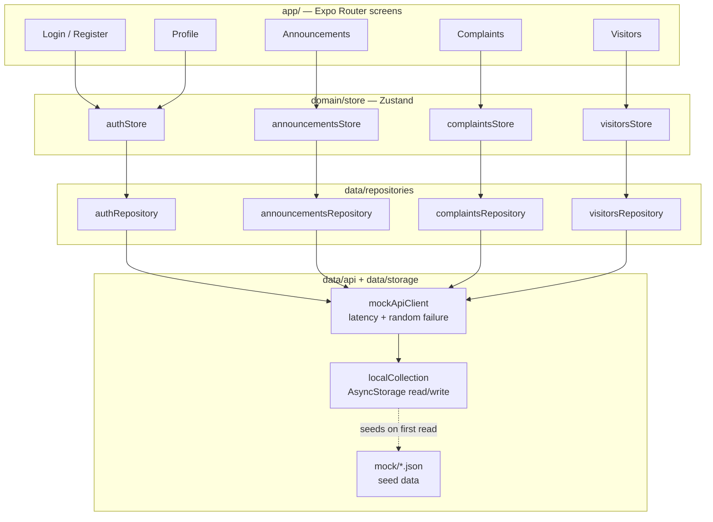
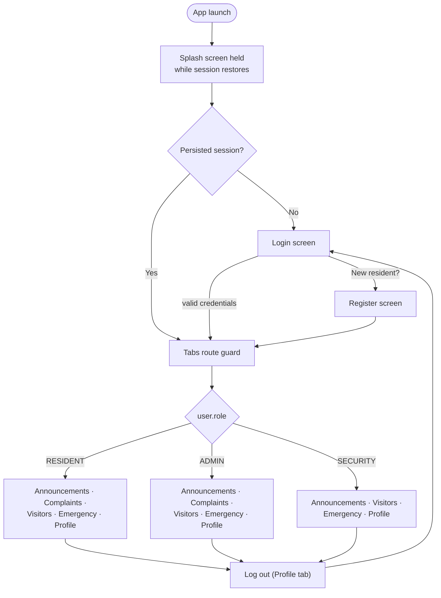
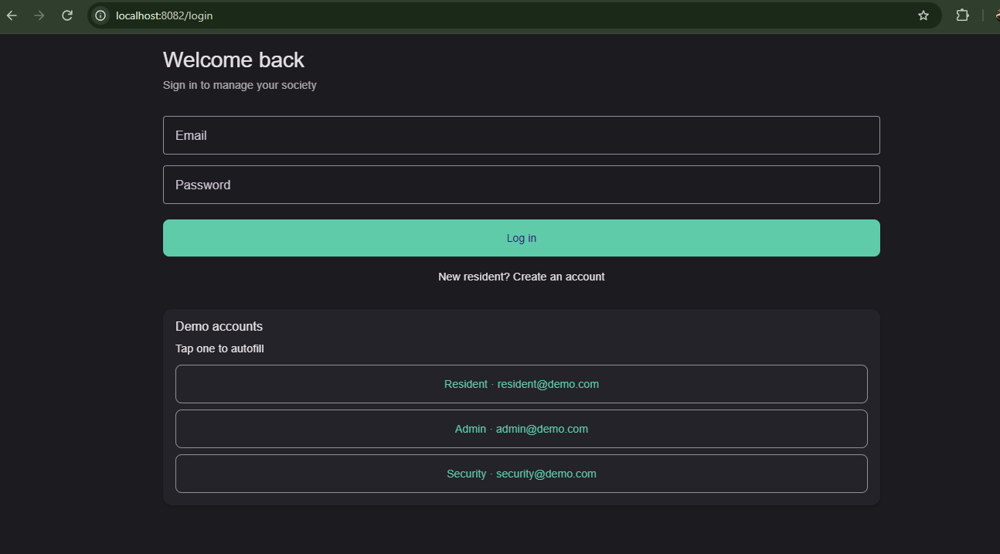
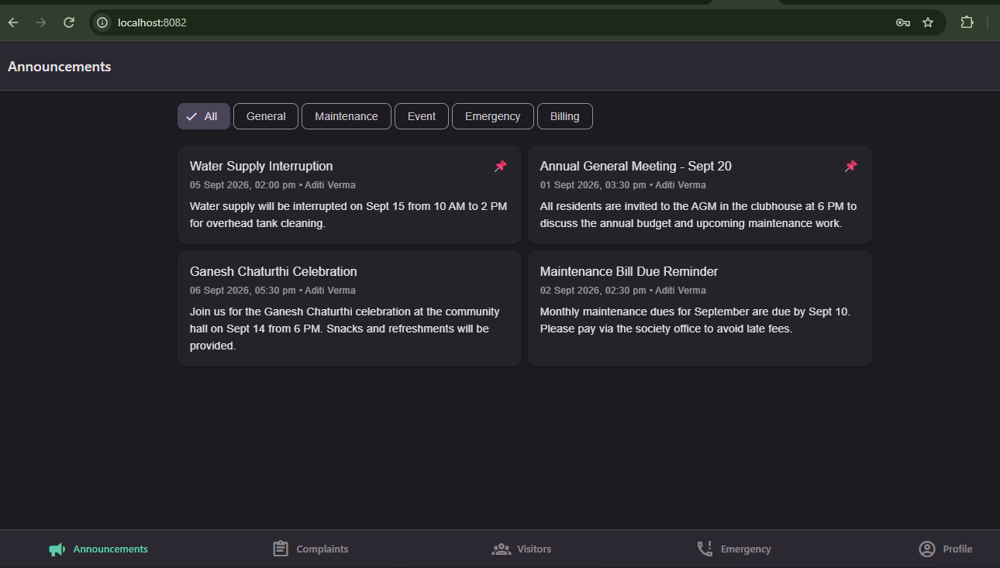
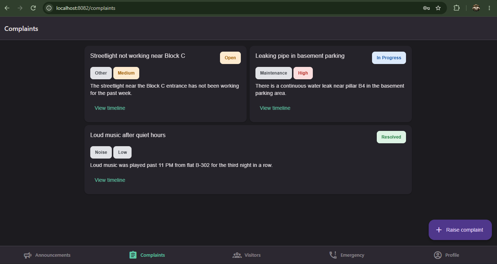
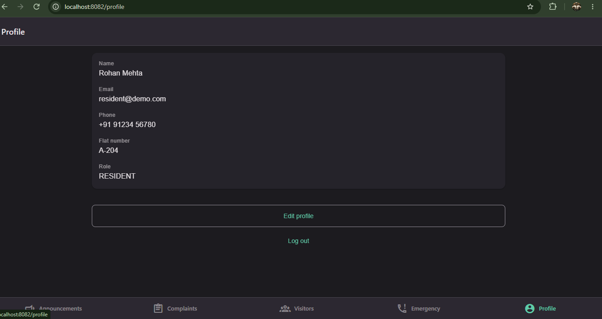

# Society Management App

A mobile-first society/apartment management app built with Expo and React Native. Residents, admins, and security staff share one app — with role-based tabs, announcements, complaints, visitor management, emergency contacts, and profile management — backed by a mock API layer so the whole thing runs standalone with no server to stand up.

## Overview

Society Management App demonstrates a clean-architecture React Native app: file-based screens that only ever talk to Zustand stores, stores that only ever talk to repositories, and repositories that are the sole layer touching persistence (AsyncStorage) and the simulated network (a mock API client with configurable latency and failure rate). Every list screen handles loading, empty, and error+retry states, and supports pull-to-refresh. The UI is responsive: it centers content on wide screens and switches list screens to a two-column grid above a 700px viewport.

## Features

| Feature | Resident | Admin | Security |
|---|---|---|---|
| **Auth** — login, register, persisted session, logout, route guard | all roles | all roles | all roles |
| **Announcements** — pinned-first list, category filter | view | view | view |
| **Complaints** — raise, track status timeline | raise & track own | view all, advance status (Open → In Progress → Resolved) | — |
| **Visitor management** — pre-approve, pass codes, check-in/out | pre-approve visitors, get a pass code | read-only visitor log | verify pass code, check in/out |
| **Emergency contacts** — static list, tap-to-call | all roles | all roles | all roles |
| **Profile** — view/edit name, phone, flat number, logout | all roles | all roles | all roles |

Tabs are role-aware — Security doesn't see a Complaints tab, since they neither raise nor manage complaints.

## Tech stack

- **Expo** (managed workflow) targeting Android, iOS, and Web
- **React Native** + **TypeScript** (strict mode)
- **Expo Router** for file-based navigation and route guards
- **Zustand** for per-feature state stores
- **AsyncStorage** for on-device persistence, seeded from bundled JSON mock data
- **React Native Paper** (Material Design 3) for the UI kit
- **Jest** + **React Native Testing Library** for unit and component tests

## Architecture

The codebase follows a strict layered flow — a screen never reaches past its store, and only repositories touch storage or the network:

```
app/          Expo Router screens only. No business logic — call stores, render state.
domain/
  store/      One Zustand store per feature: { data, status, error, actions }.
  models/     TypeScript domain types (User, Announcement, Complaint, Visitor).
data/
  repositories/  One repository per feature — the only layer that touches api/ or storage/.
  api/        mockApiClient — simulates 400–900ms latency and a ~10% random failure rate,
              disabled automatically when NODE_ENV=test.
  storage/    AsyncStorage-backed collection helpers, seeded from mock/ on first read.
  mock/       Bundled seed JSON (users, announcements, complaints, visitors).
components/   Reusable UI: AppButton, AppTextField, Card, StatusChip, LoadingState,
              EmptyState, ErrorState (with Retry), ScreenContainer.
core/         Theme, constants, date/id/validation utils, typed error classes.
```

### Component / data-flow diagram



### App flow: login to role-based tabs



## Libraries used

| Library | Purpose |
|---|---|
| `expo` | Managed workflow runtime, CLI, and build tooling |
| `expo-router` | File-based routing, route groups, and the auth/tabs route guards |
| `expo-splash-screen` | Holds the splash screen until the persisted session finishes restoring |
| `expo-linking` | Opens `tel:` links for tap-to-call on the Emergency Contacts screen |
| `@expo/vector-icons` | MaterialCommunityIcons used by Paper components and the tab bar |
| `react-native-paper` | Material Design 3 component library (buttons, inputs, cards, chips, modals) |
| `react-native-safe-area-context` | Safe-area insets for `ScreenContainer` |
| `react-native-screens` / `react-native-gesture-handler` / `react-native-reanimated` | Native navigation primitives and gesture/animation support required by Expo Router |
| `react-native-web` | Renders the same app on the web target |
| `zustand` | Small, hook-based state store — one per feature, `{ data, status, error, actions }` |
| `@react-native-async-storage/async-storage` | On-device key/value persistence for the mock backend |
| `typescript` | Static typing in strict mode |
| `jest` / `jest-expo` | Test runner and the Expo-flavored Jest preset (transforms, mocks) |
| `@testing-library/react-native` | Component rendering and interaction in tests |
| `eslint` / `eslint-config-expo` | Linting |

## Setup instructions

**Prerequisites:** Node.js 22.13+, npm, and either a physical device with [Expo Go](https://expo.dev/go), an Android emulator, an iOS simulator, or just a browser (web target needs nothing extra).

```bash
# 1. Install dependencies
npm install

# 2. Start the dev server
npx expo start

# From the interactive prompt: press "a" for Android, "i" for iOS, "w" for web,
# or scan the QR code with Expo Go on a physical device.
```

Other useful scripts:

```bash
npm run web      # start directly on the web target
npm run android  # start directly on an Android emulator/device
npm run ios      # start directly on an iOS simulator/device
npm run lint     # ESLint
npm test         # Jest — unit + component tests
npm run test:watch
```

The app seeds its mock "backend" (users, announcements, complaints, visitors) into AsyncStorage the first time each collection is read, from the JSON files in `src/data/mock/`. Clearing the app's storage (or reinstalling) resets it back to that seed data.

## Demo accounts

Shown directly on the login screen — tap one to autofill the form.

| Role | Email | Password |
|---|---|---|
| Resident | `resident@demo.com` | `123456` |
| Admin | `admin@demo.com` | `123456` |
| Security | `security@demo.com` | `123456` |

## Screenshots

Placeholders — add PNGs at these paths and they'll render here.

| | |
|---|---|
| Login |  |
| Register |  |
| Announcements |  |
| Complaints — Resident |  |
| Complaints — Admin |  |
| Visitors — Resident |  |
| Visitors — Security |  |
| Emergency Contacts |  |
| Profile |  |

## Known limitations

- **Announcement authoring isn't built yet.** All roles can view and filter announcements, but creating, pinning, and deleting them (an admin-only action) isn't implemented — the seed data is currently read-only.
- **Mock backend only.** There is no real server — `mockApiClient` simulates latency (400–900ms) and a ~10% random failure rate on top of AsyncStorage, but data lives only on the device it was created on. Nothing syncs between devices or users.
- **No real push notifications.** New announcements, complaint status changes, and visitor arrivals don't notify anyone outside the app.
- **No payments.** There's no maintenance-fee billing or payment collection of any kind.
- Pass codes and OTPs are generated locally and never actually sent by SMS/email — they're just displayed on-screen for the demo.
- No image/file uploads (e.g. complaint photos, visitor ID) and no offline write queue beyond what AsyncStorage already gives for free.

## Future improvements

- **Firebase backend** (Firestore + Auth + Cloud Functions) to replace the mock API layer with real multi-user, multi-device sync.
- **Push notifications** (Expo Notifications / FCM) for announcements, complaint status updates, and visitor check-ins.
- **Maintenance payments** — billing, payment history, and integration with a payment gateway.
- **Facility booking** — reserve the clubhouse, gym, or other shared amenities with a calendar/slot system.
- **Polls** — admin-created polls and resident voting for society decisions.
